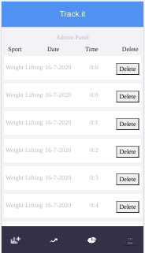
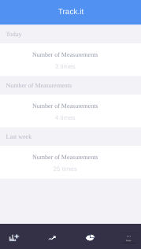

## React-Redux Capstone Project

This is a front-end sport tracking mobile app, which is useful to track the date, and duration time of any of these sports (Jogging, Cycling, Swimming, Weight lifting, Treadmill, Walking). This project was built using React and Redux.

It has a basic sign in to save the name in the redux store.

This is a mobile app, although it can be seen on big screens, the main target was for a mobile phone as it was requested, it has some responsiveness but it will be improved in a couple of weeks.The 3 progress circle bars from the home view are not set up with the pŕogress yet, at the moment it is only displaying a fixed percentage. It will be updated to display the values (today, yesterday, last week). On the other side, there are only 6 fixed sports to be measured.

The user can click to the sport and it redirects to introduce the measurement (date and time) using the timer, to be registered to the API. This app has an admin panel to load all the measurements registered in the backend and fetched to the redux store, and the user can delete the measurements. There is a measurement view to display the progress of it within time (today, yesterday, last week). It displays the number of measurements registered in a day.

  

### Prerequisites
- npm 6.14.5
- node 14.3.0

### Setup

- Run $npm install   -to install all dependencies from a package.json file
- Run on the command line: $npm start
- You will see the project on browser
- [http://localhost:3000](http://localhost:3000) to view it in the browser.

The page will reload if you make edits. 
You will also see any lint errors in the console.

## Built With

- React 16.13.1
- Redux 4.0.5
- React-Bootstrap 1.0.1
- Bootstrap 4.5.0
- Visual Code

## Live Demo

[Live Demo Link](https://sportstracking-front.herokuapp.com/)

### Prerequisites

- npm 6.14.5
- node 14.4.0

## Author:
👤 **Gonza Javier Mancilla**

- Github: [@gonjavi](https://github.com/gonjavi)
- Linkedin: [@g-javier-mancilla](https://www.linkedin.com/in/g-mancillla)

## Future Updates/Improvements

Add the following characteristics:

- Improve respopnsive styling 
- Improve the section measurements and check the progress of it within time.
- Add update measurement characteristics. 
- Allow creating new sports to measure.

## Design

Design idea by Gregoire Vella on Behance

## 🤝 Contributing

Contributions, issues and feature requests are welcome!

## Show your support

Give a ⭐️ if you like this project!

## 📝 License

This project is [MIT](lic.url) licensed.
